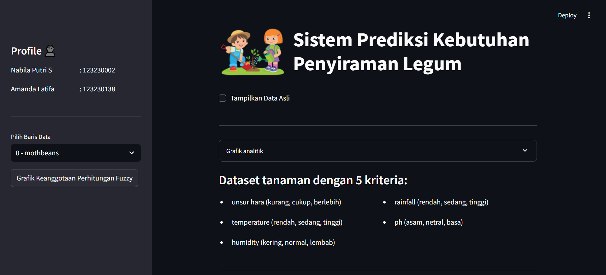
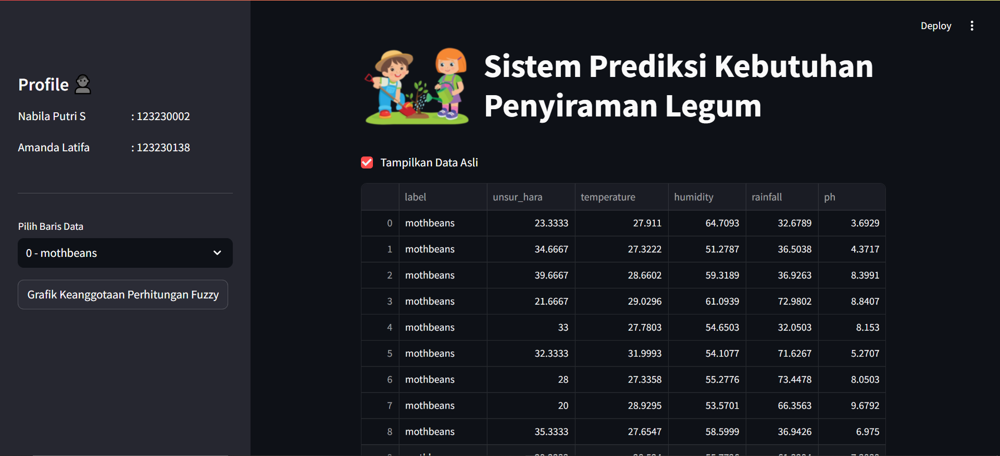
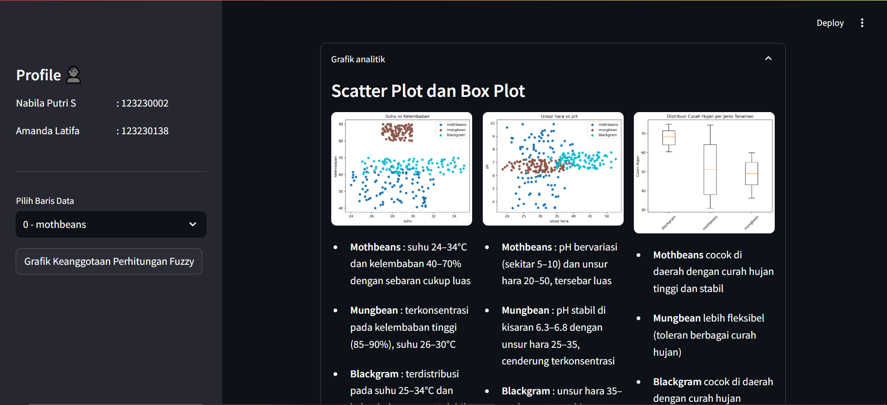
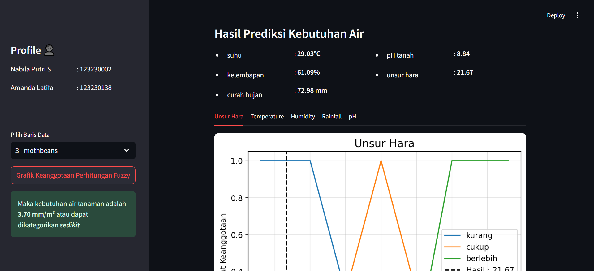
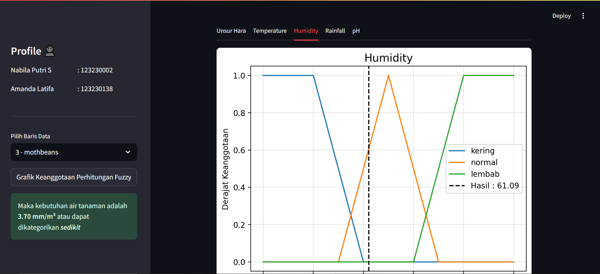
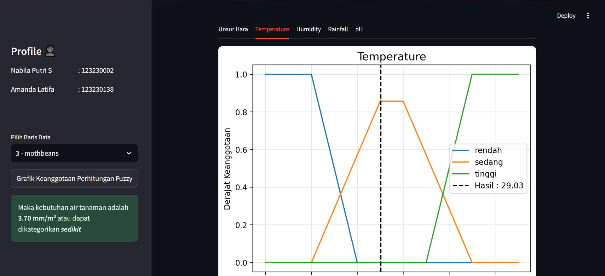

# 🌿 Watering Legum - Final Decision Support Project

An intelligent fuzzy-based decision support system to determine the optimal water requirement for legume crops such as **blackgram**, **mungbean**, and **mothbean**. Built using **Python** and **fuzzy logic (scikit-fuzzy)**, this application helps users make accurate irrigation decisions based on environmental conditions like temperature, ph, rainfall, npk, and humidity.

## 👩‍💻 Project by

- **Nabila Putri Salsabila** — 123230002
- **Amanda Latifa** — 123230138

## 📌 Features

- 🌱 Select Legume Data
- 💧 Fuzzy Inference to Determine Water Need (in milliliters)
- 📊 Visual Output Display
- 💻 Simple and Interactive UI using Streamlit (or your framework)

| Dashboard | Show Datasets | Data Grapgh |
|:----------:|:-------------:|:-------------:|
|  |  |  |

| Select Data | Fuzzy Graph | Fuzzy Grapgh |
|:----------:|:-------------:|:-------------:|
|  |  |  |

## 🛠️ Languages and Tools

     

